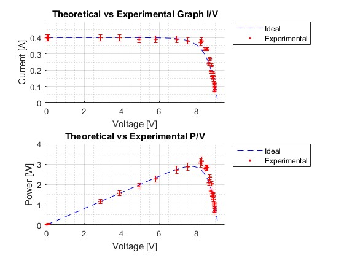
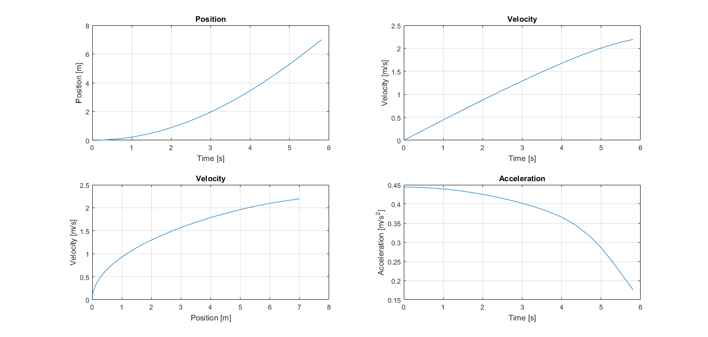
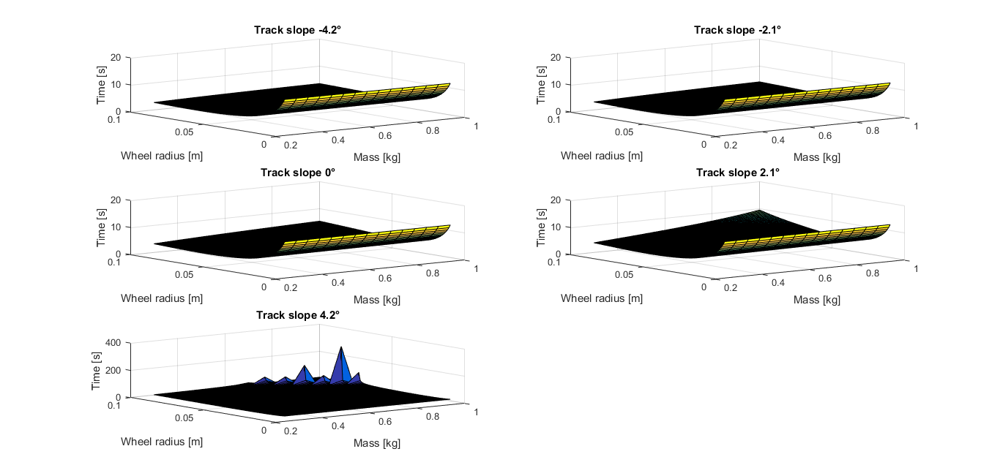
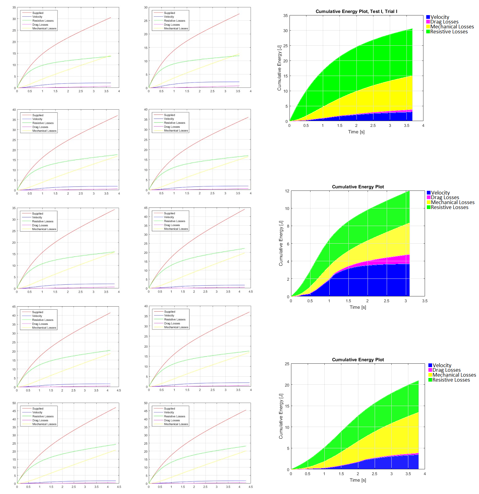

# Matlab-solar-car-modelling

Matlab model used to design SSV prototype at KULeuven.
The first series of scripts determines the solar panel characteristics.
The SSV simulation calculates parameters for the prototype, and analyzes results.

## Solar panel measurements
* Calculate ideality factor based on experimental data
* Find max power

## SSV simulation
* Simulate race performance
* Calculate optimal parameters
* Calculate energy breakdown

